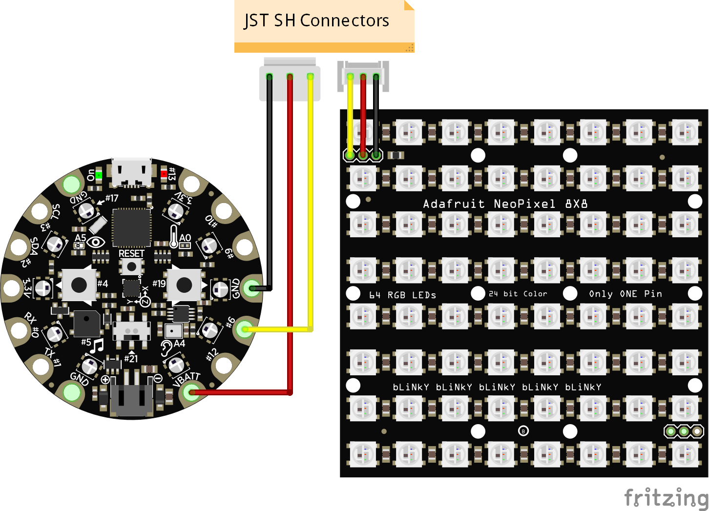

# README.md - circuitpython express matrix 8x8 display

[Circuitpython](https://circuitpython.org/) project that uses a 8x8 [LED matrix](https://www.adafruit.com/product/1487) driven by a [CircuitPlayground Express board](https://www.adafruit.com/product/3333) with some simple animations.  Used [this](https://learn.adafruit.com/sqaure-neopixel-display-with-black-led-acrylic/) guide to print the enclosures, and used the Adafruit LED animations library to run the animations.

## Steps

1. Download the files for the 3d enclosure design from the guide and use your 3d printer to print them.  

A few caveats:  the enclosure is designed for a Huzzaz board, and my old Huzzaz board didn't have SPI so it is hard to load programs onto it.  I ended up using the CircuitPlayground Express board instead as I had a few laying around.  I should really edit the enclosure so that I can attached it to the back, but for now its ok.

I also did not have the acrylic diffuser.  So i just printed it in PLA and it is thin enough that it works as a diffuser.  I did get some interesting infil patterns showing up, but it looks ok.

I used an [Ender 3D printer](https://www.creality3dofficial.com/products/official-creality-ender-3-3d-printer) from Creality.  And blue PLA from Amazon.

2. Connect your board to the 8x8 matrix. 

I'm not a very good solderer, and I'm an even worse solder-remover.  so do this right the first time, and use some connectors too.  I used a wire -> JST PH connector for the board, and for the matrix.  JSTs are your friend.  Just remember JST PH != JST SH when you order them.  And the last thing you want to do is try to crimp headers for custom JST connectors.  Crimping headers is not fun, even with a cool crimp tool. 

See: https://www.youtube.com/watch?v=FMXdXCYvLQQ

3. Once the board is connected to the matrix display, then connect the board to your computer and it should be accessible as a USB drive.  Copy the `code/*` onto your board.  So `code/code.py` should be at the top level of the board, and it should habe a `lib` directory with some libraries.  

Now, that is assuming you have circuit python already flashed on the board.  I had some strange issues with the USB connectivity, so i also updated the U2F firmware on my board, then installed CircuitPython on it.  I'm using CircuitPython version 6.0 fresh off the press.  

After you copy the files on the board, that's it, you should see the led's light up in an annimation.  If not, check the pins in the `code.py` file to see if it matches your circuit.  

Here's what it looks like at the end:

Note:  the example in `code.py` uses a modified version of the [Adafruit_Led_Animation library](https://github.com/Summit-Coding-Club/Adafruit_CircuitPython_LED_Animation) that supports the masking parameter.  I've submitted a PR for that, but till then, you have to build it yourself or take out the mask parameters.

# Links

* [Square NeoPixel Display with Black LED Acrylic](https://learn.adafruit.com/sqaure-neopixel-display-with-black-led-acrylic/)
* [JST Connector Crimping Insanity](https://iotexpert.com/jst-connector-crimping-insanity/)
* [BRADLEY GAWTHROP: WHAT YOU NEED TO KNOW ABOUT WIRING](https://hackaday.com/2018/01/12/bradley-gawthrop-what-you-need-to-know-about-wiring/)
